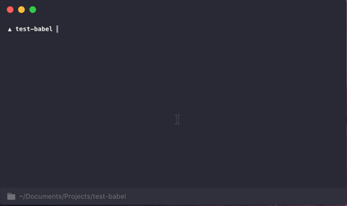

<h1 align="center">
  init-babel
  <br>
</h1>
<p align="center" style="font-size: 1.2rem;">Help you configure babel for your project.</p>

[![version][version-badge]][package]
[![MIT License][license-badge]][LICENSE]



Created to find a solution to the issue from babel repo : [#3977](https://github.com/babel/babel/issues/3977)

## Install

```
  yarn global add init-babel
  npm install -g init-babel
```

## Basic Usage
```bash
$ init-babel
```

You can use it with [npx](https://github.com/zkat/npx)

```bash
$ npx init-babel
```

## LICENSE

MIT

[version-badge]: https://img.shields.io/npm/v/init-babel.svg?style=flat-square
[package]: https://www.npmjs.com/package/init-babel
[license-badge]: https://img.shields.io/npm/l/init-babel.svg?style=flat-square
[license]: https://github.com/paypal/init-babel/blob/master/LICENSE